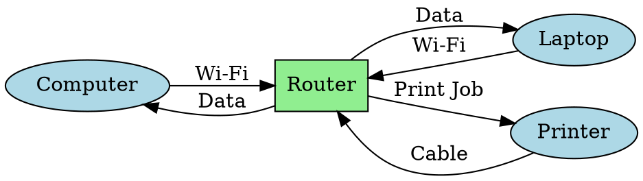
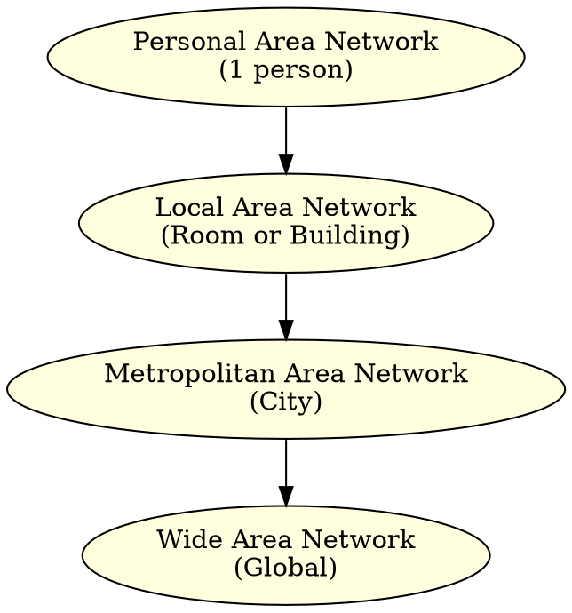
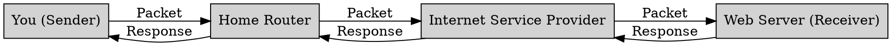
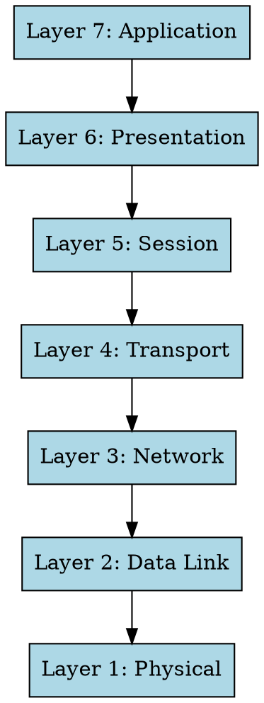
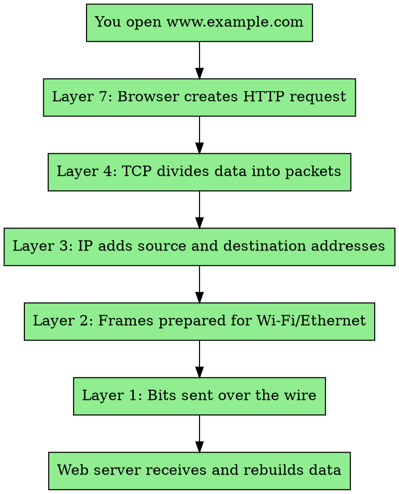

# Fundamentals of Computer Networking (Level 1)

**Author** Dr. Jakob W. Kunzler

**Contact** jake.kunzler@gmail.com

**Last Updated** Nov 2 2025

**License** This curriculum is distributed under the creative commons license 4.0.

**Copyright Jakob W. Kunzler 2025**

## Scope

* Beginner students grades 7 - 12 with no prior programming expierence  
* 45 minutes of reading
* 15 minutes of lab

--- 

## Objectives

* Learn about:
  * What Are Computer Networks
  * The OSI Networking Model
  * Clients and Servers
  * Local Area Networks
  * IPV4 Addresses
  * The ZMQ library

--- 

## Instructions

1. Students should read through the theory section in three passes.  The first pass is just to glean key information and ideas from looking at the heading and figures.  The second pass should read the text focusing on main ideas.  The third pass should focus on small details.
2. Complete the lab demo independently for the localhost demonstration.
3. Find a partner and complete this demo with two computer sending messages to each other.

--- 

## Theory

### Computer Networks

#### What is Computer Networking?

Computer networking is the practice of **connecting computers and other devices** so they can **communicate, share resources, and exchange information**.

When you send a text, watch a video, or play an online game — you’re using a **computer network**!

---

#### Why Do We Use Networks?

Networks make it possible to:

* **Share information** (like files, messages, and videos)
* **Connect to the internet**
* **Access shared hardware** (like printers or servers)
* **Collaborate in real-time** (like in Google Docs or online games)

---

#### Basic Parts of a Computer Network

A computer network is made up of several key components:

* **Devices (Nodes):** Computers, phones, printers, etc.
* **Links:** Cables or wireless signals that connect devices.
* **Network Hardware:** Routers, switches, and access points that help data move.
* **Protocols:** Rules that control how data is sent and received (like how people follow grammar rules in conversation).

---

#### Diagram: How Devices Connect

This shows how a **router** connects all devices together, allowing them to share data.

---

#### Types of Networks

| Type                            | Description                            | Example                                |
| ------------------------------- | -------------------------------------- | -------------------------------------- |
| **LAN** (Local Area Network)    | Connects computers close together      | A home, classroom, or school           |
| **WAN** (Wide Area Network)     | Connects networks over large distances | The Internet!                          |
| **WLAN** (Wireless LAN)         | A LAN that uses Wi-Fi                  | Coffee shop Wi-Fi                      |
| **PAN** (Personal Area Network) | Very small network for one person      | Bluetooth between phone and headphones |

---

#### Diagram: Network Types by Size

---

#### How Data Moves in a Network

When you send a message or open a website, your computer breaks the information into **packets** — small chunks of data.
These packets travel across cables or wireless signals, through routers and switches, until they reach the destination.

---

#### Diagram: Data Flow Example

---

#### Computer Network **Key Takeaways:**
Computer networking is what allows **digital communication** to happen.
It connects people, devices, and systems across the world — forming the foundation of the **Internet** itself.

* Networks let computers **communicate and share** information.
* Devices connect using **hardware** (like routers) and **protocols** (like TCP/IP).
* Data travels in **packets** across different kinds of networks (LAN, WAN, etc.).

---

### What is the OSI Networking Model?

The **OSI Model** (Open Systems Interconnection Model) is a **conceptual framework** that explains **how computers communicate** over a network.

It breaks the process into **7 layers**, each with a specific job.
By dividing communication into layers, different technologies can work together smoothly — like how musicians play different instruments in harmony.

---

#### Why Do We Use the OSI Model?

The OSI model helps engineers and students:

* Understand **how data moves** from one device to another
* Design and troubleshoot **networks**
* Make sure **hardware and software** from different companies can work together

---

#### The 7 Layers of the OSI Model

| # | Layer Name       | Purpose                                        | Example                           |
| - | ---------------- | ---------------------------------------------- | --------------------------------- |
| 7 | **Application**  | Provides network services to the user          | Web browser, email app            |
| 6 | **Presentation** | Formats and encrypts data                      | JPEG, MP3, SSL                    |
| 5 | **Session**      | Manages connections between devices            | Keeps you logged into a website   |
| 4 | **Transport**    | Ensures data is sent correctly                 | TCP, UDP                          |
| 3 | **Network**      | Finds the best route for data                  | IP addresses, routers             |
| 2 | **Data Link**    | Moves data between devices on the same network | Ethernet, Wi-Fi                   |
| 1 | **Physical**     | Sends raw bits over cables or air              | Cables, radio waves, fiber optics |

---

#### Diagram: The 7 Layers of the OSI Model

This shows the **“top-down”** view — from what you see (like a webpage) to the physical signals moving through wires.

---

#### How the OSI Model Describes Communication

When two computers talk, **data travels down the layers** on one machine, across the network, and then **up the layers** on the other.

* The **sender** starts at the **Application layer** (top) and moves **down** to the Physical layer.
* The **receiver** starts at the **Physical layer** and moves **up** to the Application layer.

Each layer adds or removes information that helps the next layer do its job — this is called **encapsulation**.

---

#### Diagram: Communication Between Two Computers

```dot
digraph osi_communication {
  rankdir=LR;
  node [shape=box, style=filled, fillcolor=lightyellow];

  subgraph cluster_sender {
    label="Sender";
    style=filled;
    color=lightgray;
    appS [label="App Layer"];
    transS [label="Transport"];
    netS [label="Network"];
    linkS [label="Data Link"];
    physS [label="Physical"];
    appS -> transS -> netS -> linkS -> physS;
  }

  subgraph cluster_receiver {
    label="Receiver";
    style=filled;
    color=lightgray;
    appR [label="App Layer"];
    transR [label="Transport"];
    netR [label="Network"];
    linkR [label="Data Link"];
    physR [label="Physical"];
    physR -> linkR -> netR -> transR -> appR;
  }

  physS -> physR [label="Bits traveling over cables or Wi-Fi"];
}
```

This shows how data travels **through the layers**, across the network, and back **up** on the other side.

---

#### Example: Visiting a Website

When you type a web address like `www.example.com`:

1. **Application Layer:** Your browser sends an HTTP request.
2. **Presentation Layer:** Data is formatted and encrypted (HTTPS).
3. **Session Layer:** Keeps your connection open while loading the page.
4. **Transport Layer:** Breaks the data into packets (TCP).
5. **Network Layer:** Adds IP addresses to send packets to the right destination.
6. **Data Link Layer:** Wraps data into frames for your Wi-Fi or Ethernet.
7. **Physical Layer:** Sends the bits as electrical signals or radio waves.

---

#### Diagram: OSI Layers in Action (Web Example)

---

#### OSI Model **Key Takeaways:**

The **OSI Model** is like a **blueprint** for how information travels between computers.

Each layer has its own **responsibility**, and together they make sure that data gets from one machine to another **reliably and accurately**.

* The OSI Model has **7 layers**, from **Physical** to **Application**.
* Each layer performs a **specific role** in communication.
* Data flows **down through layers** on the sender and **up through layers** on the receiver.
* It helps us **understand, design, and troubleshoot** networks.

---

