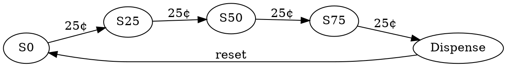
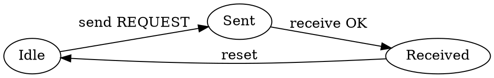
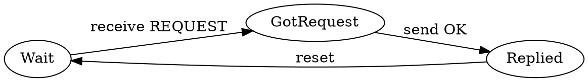
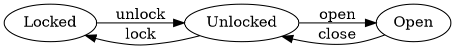

# State Machines (Level 2)

**Author** Dr. Jakob W. Kunzler

**Contact** jake.kunzler@gmail.com

**Last Updated** Nov 17 2025

**License** This curriculum is distributed under the creative commons license 4.0.

**Copyright Jakob W. Kunzler 2025**

## Scope

* Students with a basic understanding of the python language
* 15 minutes of reading
* 15-30 minutes of lab

--- 

## Objectives

By the end of this lesson, students will be able to:

* Understand what a **state machine** is.
* Explain why state machines are useful in programming, communication, and games.
* Read and create simple **state diagrams** using DOT language.
* Implement a **basic state machine in Python**.
* Understand how **two interacting state machines** can be used to build token-based communication.

---

## Theory 

### What is a State Machine?

A **state machine** (also called a *finite state machine* or *FSM*) is:

> A model of computation where something can be in **one state at a time**, and events or inputs cause it to *transition* to another state.

Examples of things that behave like state machines:

* A vending machine
* A traffic light
* Your phone’s lock/unlock screen
* A video game menu
* Network communication protocols

### Why are state machines useful?

Because they help you:

* **Organize your program’s behavior** into clear steps
* Prevent messy “if this AND this except when that” logic
* Make communication systems predictable
* Make games easier to write and debug

State machines are used in:

* Robotics
* User interfaces
* Network protocols (Bluetooth, USB, WiFi)
* Authentication systems
* Game logic

---

### Example: Soda Machine Controller

Imagine a soda machine that dispenses a drink when the customer inserts **$1.00**.
The machine accepts **quarters (25¢)**.

The machine has these states:

* **S0**: 0¢
* **S25**: 25¢
* **S50**: 50¢
* **S75**: 75¢
* **Dispense**: Give soda → return to S0

### DOT Language Diagram (Graphviz)
The [Graphviz](https://graphviz.org/) software tool is frequently used by software developers to create flow charts from text in the "dot" language. Markdown documents are smart enough to render the flow charts if you have graphviz installed. Simply put the dot text between dot language tags (view this file's source code for an example).

Usually developers install graphviz on your machine, but sometimes it's convenient to use online viewers (e.g., [https://dreampuf.github.io/GraphvizOnline](https://dreampuf.github.io/GraphvizOnline)):



---

### Python Implementation of the Soda Machine

```python
class SodaMachine:
    def __init__(self):
        self.state = 0  # amount inserted in cents

    def insert_quarter(self):
        if self.state < 75:
            self.state += 25
            print(f"Current amount: {self.state}¢")
        elif self.state == 75:
            self.state = 0
            print("Dispensing soda! Returning to 0¢.")

# Demo:
machine = SodaMachine()
machine.insert_quarter()
machine.insert_quarter()
machine.insert_quarter()
machine.insert_quarter()
```

---

### Interacting State Machines: Communication Protocols

Modern communication (WiFi, USB, Bluetooth, multiplayer games) uses **protocols**, which are usually built from **two or more interacting state machines**.

For example:

* Machine A sends a **token** "READY"
* Machine B responds with **ACK**
* Then A sends data
* B sends **DONE**

Each device follows its own state machine, and together they form a protocol.

#### Why do this?

Because:

* It prevents chaos (“everyone talking at once”)
* It ensures both sides agree on when to send/receive
* It creates predictable, testable communication

Later we will build:

> **A tic-tac-toe game where two players communicate moves using token messages over a network.**

---

### DOT Diagram Example: Two Machines Talking

Here is a simple request/response protocol:

### Machine A:

Sends a request → waits → receives answer → done



### Machine B:

Waits → receives request → sends OK → done



Later, this becomes the basis of the tic-tac-toe messaging system!

---
### Summary

This section has covered:

* What state machines are
* Why they help structure logic in software
* How they appear in **vending machines, games, and communication protocols**
* How to draw them in **DOT language**
* How to implement them in **Python**
* How two machines can work together to form **token-based communication**

## Lab Exercise

### Objective

Students will create a simple Python state machine that models a **door** that can be:

* **Locked**
* **Unlocked**
* **Open**

### Rules:

* You can’t open a locked door.
* You must unlock it first.
* You can’t lock it while it’s open.

---

### **Step 1: DOT Diagram**

[Install](https://graphviz.org/download/) the graphviz tool for your operating system.

Try to create this diagram yourself using the DOT language.  



---

### **Step 2: Python Implementation**

Now try to implement the machine in python code.  Try it yourself, but the solution is below.

```python
class DoorStateMachine:
    def __init__(self):
        self.state = "Locked"

    def unlock(self):
        if self.state == "Locked":
            self.state = "Unlocked"
        print("State:", self.state)

    def lock(self):
        if self.state == "Unlocked":
            self.state = "Locked"
        print("State:", self.state)

    def open(self):
        if self.state == "Unlocked":
            self.state = "Open"
        print("State:", self.state)

    def close(self):
        if self.state == "Open":
            self.state = "Unlocked"
        print("State:", self.state)

```

You should now be able to execute the following sequence in a script:

```python
door = DoorStateMachine()
door.unlock()
door.open()
door.close()
door.lock()
```

---

### **Challenge Extension**

Expand the door state machine to include:

* “Alarm” state
* Automatic lock after 10 seconds
* A broken hinge state

---

