# Fundamentals of Computer Networking (Level 1)

**Author** Dr. Jakob W. Kunzler

**Contact** jake.kunzler@gmail.com

**Last Updated** Nov 2 2025

**License** This curriculum is distributed under the creative commons license 4.0.

**Copyright Jakob W. Kunzler 2025**

## Scope

* Beginner students grades 7 - 12 with no prior programming expierence  
* 45 minutes of reading
* 15 minutes of lab

--- 

## Objectives

By the end of this lesson, students will learn:
  * What Are Computer Networks
  * The OSI Networking Model
  * Clients and Servers
  * Local Area Networks
  * DNS
  * IPV4 Addresses
  * The netcat tool

--- 

## Instructions

1. Students should read through the theory section in three passes.  The first pass is just to glean key information and ideas from looking at the heading and figures.  The second pass should read the text focusing on main ideas.  The third pass should focus on small details.
2. Complete the lab demo independently for the localhost demonstration.
3. Find a partner and complete this demo with two computer sending messages to each other.

--- 

## Theory

### Computer Networks

#### What is Computer Networking?

Computer networking is the practice of **connecting computers and other devices** so they can **communicate, share resources, and exchange information**.

When you send a text, watch a video, or play an online game — you’re using a **computer network**!

---

#### Why Do We Use Networks?

Networks make it possible to:

* **Share information** (like files, messages, and videos)
* **Connect to the internet**
* **Access shared hardware** (like printers or servers)
* **Collaborate in real-time** (like in Google Docs or online games)

---

#### Basic Parts of a Computer Network

A computer network is made up of several key components:

* **Devices (Nodes):** Computers, phones, printers, etc.
* **Links:** Cables or wireless signals that connect devices.
* **Network Hardware:** Routers, switches, and access points that help data move.
* **Protocols:** Rules that control how data is sent and received (like how people follow grammar rules in conversation).

---

#### Diagram: How Devices Connect

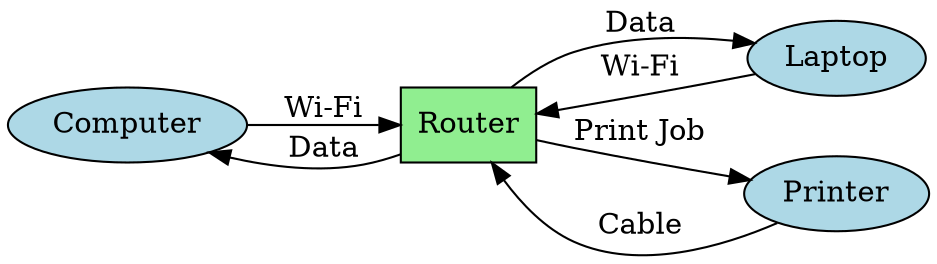

This shows how a **router** connects all devices together, allowing them to share data.

---

#### Types of Networks

| Type                            | Description                            | Example                                |
| ------------------------------- | -------------------------------------- | -------------------------------------- |
| **LAN** (Local Area Network)    | Connects computers close together      | A home, classroom, or school           |
| **WAN** (Wide Area Network)     | Connects networks over large distances | The Internet!                          |
| **WLAN** (Wireless LAN)         | A LAN that uses Wi-Fi                  | Coffee shop Wi-Fi                      |
| **PAN** (Personal Area Network) | Very small network for one person      | Bluetooth between phone and headphones |

---

#### Diagram: Network Types by Size

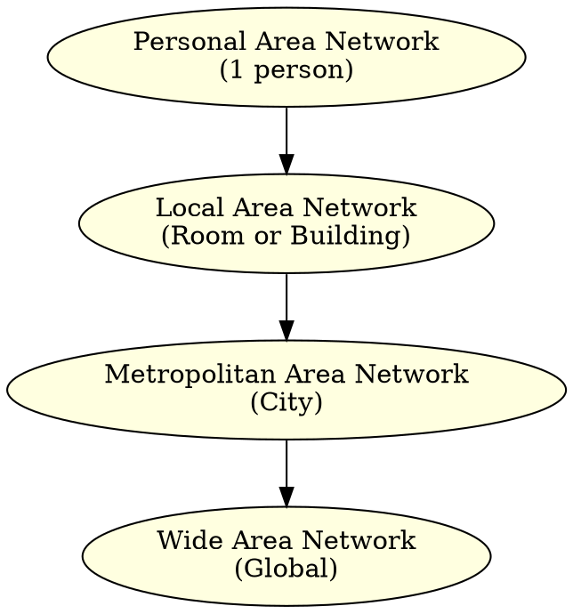
---

#### How Data Moves in a Network

When you send a message or open a website, your computer breaks the information into **packets** — small chunks of data.
These packets travel across cables or wireless signals, through routers and switches, until they reach the destination.

---

#### Diagram: Data Flow Example

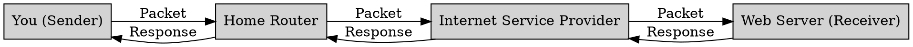
---

#### Computer Network **Key Takeaways:**
Computer networking is what allows **digital communication** to happen.
It connects people, devices, and systems across the world — forming the foundation of the **Internet** itself.

* Networks let computers **communicate and share** information.
* Devices connect using **hardware** (like routers) and **protocols** (like TCP/IP).
* Data travels in **packets** across different kinds of networks (LAN, WAN, etc.).

---

### What is the OSI Networking Model?

The **OSI Model** (Open Systems Interconnection Model) is a **conceptual framework** that explains **how computers communicate** over a network.

It breaks the process into **7 layers**, each with a specific job.
By dividing communication into layers, different technologies can work together smoothly — like how musicians play different instruments in harmony.

---

#### Why Do We Use the OSI Model?

The OSI model helps engineers and students:

* Understand **how data moves** from one device to another
* Design and troubleshoot **networks**
* Make sure **hardware and software** from different companies can work together

---

#### The 7 Layers of the OSI Model

| # | Layer Name       | Purpose                                        | Example                           |
| - | ---------------- | ---------------------------------------------- | --------------------------------- |
| 7 | **Application**  | Provides network services to the user          | Web browser, email app            |
| 6 | **Presentation** | Formats and encrypts data                      | JPEG, MP3, SSL                    |
| 5 | **Session**      | Manages connections between devices            | Keeps you logged into a website   |
| 4 | **Transport**    | Ensures data is sent correctly                 | TCP, UDP                          |
| 3 | **Network**      | Finds the best route for data                  | IP addresses, routers             |
| 2 | **Data Link**    | Moves data between devices on the same network | Ethernet, Wi-Fi                   |
| 1 | **Physical**     | Sends raw bits over cables or air              | Cables, radio waves, fiber optics |

---

#### Diagram: The 7 Layers of the OSI Model

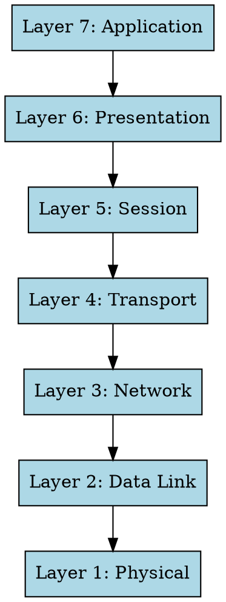

This shows the **“top-down”** view — from what you see (like a webpage) to the physical signals moving through wires.

---

#### How the OSI Model Describes Communication

When two computers talk, **data travels down the layers** on one machine, across the network, and then **up the layers** on the other.

* The **sender** starts at the **Application layer** (top) and moves **down** to the Physical layer.
* The **receiver** starts at the **Physical layer** and moves **up** to the Application layer.

Each layer adds or removes information that helps the next layer do its job — this is called **encapsulation**.

---

#### Diagram: Communication Between Two Computers

```dot
digraph osi_communication {
  rankdir=LR;
  node [shape=box, style=filled, fillcolor=lightyellow];

  subgraph cluster_sender {
    label="Sender";
    style=filled;
    color=lightgray;
    appS [label="App Layer"];
    transS [label="Transport"];
    netS [label="Network"];
    linkS [label="Data Link"];
    physS [label="Physical"];
    appS -> transS -> netS -> linkS -> physS;
  }

  subgraph cluster_receiver {
    label="Receiver";
    style=filled;
    color=lightgray;
    appR [label="App Layer"];
    transR [label="Transport"];
    netR [label="Network"];
    linkR [label="Data Link"];
    physR [label="Physical"];
    physR -> linkR -> netR -> transR -> appR;
  }

  physS -> physR [label="Bits traveling over cables or Wi-Fi"];
}
```

This shows how data travels **through the layers**, across the network, and back **up** on the other side.

---

#### Example: Visiting a Website

When you type a web address like `www.example.com`:

1. **Application Layer:** Your browser sends an HTTP request.
2. **Presentation Layer:** Data is formatted and encrypted (HTTPS).
3. **Session Layer:** Keeps your connection open while loading the page.
4. **Transport Layer:** Breaks the data into packets (TCP).
5. **Network Layer:** Adds IP addresses to send packets to the right destination.
6. **Data Link Layer:** Wraps data into frames for your Wi-Fi or Ethernet.
7. **Physical Layer:** Sends the bits as electrical signals or radio waves.

---

#### Diagram: OSI Layers in Action (Web Example)

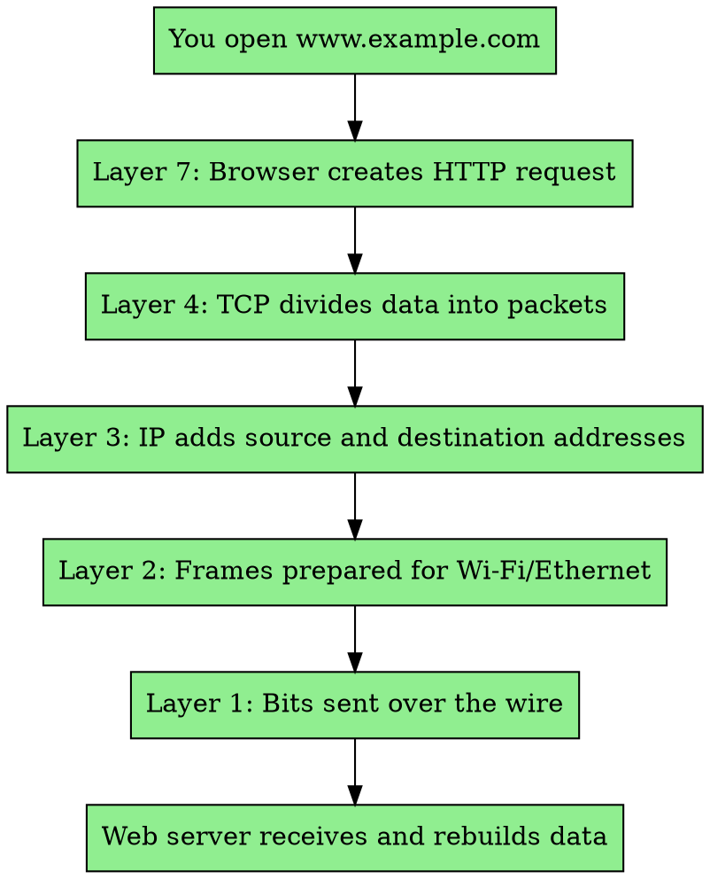

---

#### OSI Model **Key Takeaways:**

The **OSI Model** is like a **blueprint** for how information travels between computers.

Each layer has its own **responsibility**, and together they make sure that data gets from one machine to another **reliably and accurately**.

* The OSI Model has **7 layers**, from **Physical** to **Application**.
* Each layer performs a **specific role** in communication.
* Data flows **down through layers** on the sender and **up through layers** on the receiver.
* It helps us **understand, design, and troubleshoot** networks.

---

Absolutely! Here’s a **markdown lesson** on **Clients and Servers**, written for **grades 7–12**, with `.dot` diagrams to clearly show how they interact in a network.

---

### What Are the Roles of Clients and Servers?

In computer networking, **clients** and **servers** are two main types of devices that **work together to share information and services**.

They form the **client–server model**, which is the foundation of how most of the Internet works today.

---

#### The Big Idea

* A **client** is a device (like your phone or laptop) that **requests** something.
* A **server** is a powerful computer that **responds** to those requests by **providing** information or services.

Think of it like a restaurant:

* You (the **client**) order food.
* The **server** (waiter/kitchen) prepares it and brings it back to you.

---

#### Roles of Each

| Role       | Description                                            | Examples                                |
| ---------- | ------------------------------------------------------ | --------------------------------------- |
| **Client** | Sends requests and displays results to the user        | Web browsers, apps, phones              |
| **Server** | Receives requests, processes them, and sends back data | Web servers, mail servers, file servers |

---

#### Diagram: Basic Client–Server Relationship

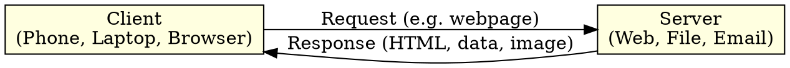

This shows how **requests** and **responses** flow between a client and a server.

---

#### Real-Life Examples

| Scenario               | Client             | Server                              |
| ---------------------- | ------------------ | ----------------------------------- |
| Visiting a website     | Your web browser   | A web server (like Apache or Nginx) |
| Sending an email       | Your mail app      | An email server                     |
| Watching a video       | Your YouTube app   | A streaming server                  |
| Playing an online game | Your console or PC | The game company’s server           |

---

#### How It Works Step-by-Step

When you visit a website:

1. You open a browser and type a web address.
2. Your computer (the **client**) sends a **request** to the web server.
3. The **server** finds the page and sends back the **response** (HTML, images, etc.).
4. Your browser displays the website on your screen.

---

#### Diagram: Client Request Flow

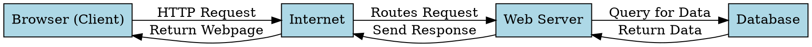

This diagram shows how data travels **through multiple layers** — from client to server, and sometimes to a database, before returning back to the user.

---

#### Types of Servers

| Server Type         | Purpose                    | Example             |
| ------------------- | -------------------------- | ------------------- |
| **Web Server**      | Stores and sends web pages | Apache, Nginx       |
| **File Server**     | Stores and shares files    | Windows File Server |
| **Mail Server**     | Handles email              | Gmail, Outlook      |
| **Game Server**     | Hosts online games         | Minecraft Server    |
| **Database Server** | Manages structured data    | MySQL, PostgreSQL   |

---

#### Diagram: Multiple Clients and One Server

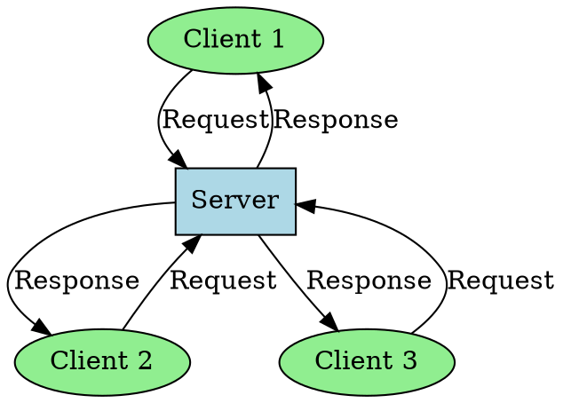

This shows how **one server** can handle **many clients** at once — like a library serving multiple readers.

---

#### Alternative Model: Peer-to-Peer (P2P)

Not all systems use the client-server model.
In **peer-to-peer (P2P)** networks, **each computer can act as both a client and a server**.

Examples:

* File sharing (like BitTorrent)
* Multiplayer games on local networks

#### Diagram: Client–Server vs. Peer-to-Peer

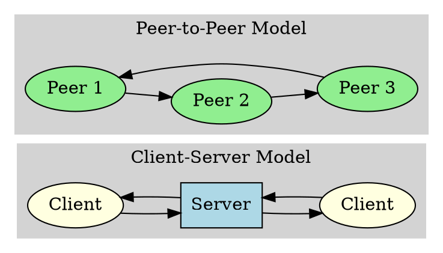
---

#### Clients and Servers **Key Takeaways:**

**Clients and servers** are like the **requesters and providers** of the digital world.
They form the backbone of how the Internet works — from loading a website to sending an email.

* A **client** asks for data or services.
* A **server** provides the requested data or services.
* The **client–server model** powers most of the Internet.
* Some systems use **peer-to-peer (P2P)** instead, where all computers share equally.

---

###  What Is an IP Address?

Every device connected to the Internet — your phone, laptop, game console, or even a smart fridge — needs a **unique identifier** so data can be sent to and from it.

That identifier is called an **IP address**.

---

#### The Big Idea

**IP** stands for **Internet Protocol** — the set of rules that defines how devices **locate** and **communicate** with each other on a network.

An **IP address** is like your **home address**:

* It tells other computers **where to send information** (like a letter or package).
* Without it, your data wouldn’t know where to go.

---

#### What an IP Address Looks Like

There are two main versions:

| Version  | Name                        | Example                                   | Format                                  | Total Addresses                   |
| -------- | --------------------------- | ----------------------------------------- | --------------------------------------- | --------------------------------- |
| **IPv4** | Internet Protocol version 4 | `192.168.1.1`                             | Four numbers (0–255) separated by dots  | ~4.3 billion                      |
| **IPv6** | Internet Protocol version 6 | `2001:0db8:85a3:0000:0000:8a2e:0370:7334` | Eight groups of four hexadecimal digits | ~340 undecillion (a huge number!) |

---

#### Analogy

| Concept                      | Real Life                           | Networking       |
| ---------------------------- | ----------------------------------- | ---------------- |
| Home address                 | 123 Maple St.                       | 192.168.1.5      |
| Postal service               | Mail delivery                       | Internet routers |
| Envelope with return address | Data packet with source/destination | IP packet        |

Just like a **postal address** gets mail to your house, an **IP address** gets data to your device.

---

#### Diagram: Sending a Packet Across the Internet

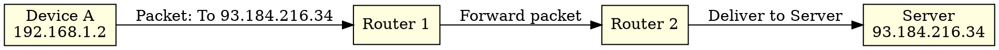

This shows how data moves **from one IP address to another** through routers until it reaches the right destination.

---

#### IPv4: The Classic Address

IPv4 addresses are **32 bits long**, divided into four sections called **octets**.
Example:

```
192.168.1.5
```

Each part can go from **0 to 255**, because 8 bits can represent 256 possible values.

---

#### Diagram: IPv4 Breakdown

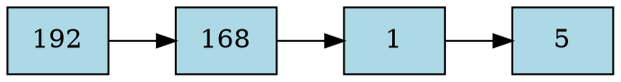

So `192.168.1.5` = 4 numbers × 8 bits = 32 bits total.

---

#### IPv6: The Future of Addressing

The Internet is running out of IPv4 addresses — there are **more devices than addresses available!**

That’s why IPv6 was created.
It uses **128 bits** instead of 32, allowing for a **massive number of unique addresses** — enough for every grain of sand on Earth (and then some!).

IPv6 looks like this:

```
2001:0db8:85a3:0000:0000:8a2e:0370:7334
```

You can shorten it:

```
2001:db8:85a3::8a2e:370:7334
```

---

#### Diagram: IPv4 vs IPv6

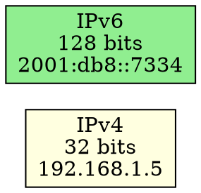

---

####  Types of IP Addresses

| Type           | Description                                              | Example                                   |
| -------------- | -------------------------------------------------------- | ----------------------------------------- |
| **Public IP**  | Used on the Internet — globally unique                   | `8.8.8.8` (Google DNS)                    |
| **Private IP** | Used inside local networks — not visible to the Internet | `192.168.x.x`, `10.x.x.x`                 |
| **Static IP**  | Does not change                                          | Used by servers                           |
| **Dynamic IP** | Changes over time                                        | Common for home devices (assigned by ISP) |

---

#### Diagram: Private vs Public IPs in a Home Network

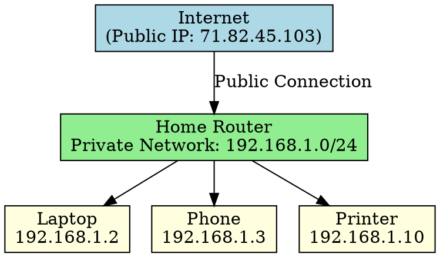

This shows how one **public IP address** connects many **private devices** through your router.

---

####  How Devices Get Their IP

Most devices don’t set their IP manually.
They use **DHCP (Dynamic Host Configuration Protocol)**, which automatically assigns them an IP address when they connect to a network.

---

#### Diagram: DHCP Address Assignment

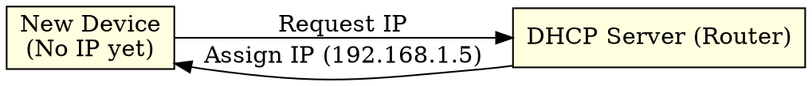

---

#### IP Addresses and Security

Your IP address can reveal:

* Your **approximate location** (city or region)
* Your **Internet provider**
* Which **network** you’re on

That’s why some people use **VPNs (Virtual Private Networks)** to mask or change their visible IP for privacy.

---

#### IP Addresses **Key Takeaways:**

An **IP address** is how devices identify and talk to each other on the Internet.
It’s the foundation for all communication — from visiting websites to sending emails.

* **IP** = Internet Protocol
* **IPv4** = older, 32-bit addresses
* **IPv6** = newer, 128-bit addresses
* **Public IPs** connect to the Internet
* **Private IPs** are used inside networks
* **DHCP** automatically assigns IPs
* **Routers** translate between public and private networks

---

### How DNS Helps Clients Find Servers

Every time you visit a website — like `www.google.com` — your computer needs to know **where that website actually lives** on the Internet.

Computers don’t use words to find each other; they use **IP addresses** (like phone numbers).
The **Domain Name System (DNS)** is what translates **names** (like `google.com`) into **numbers** (like `142.250.72.14`).

---

#### The Main Idea

**DNS** is like the **Internet’s phone book**.
It helps your computer **find the address** of the server that hosts the website you want to visit.

When you type a web address:

1. Your computer (the **client**) asks the **DNS system** for the server’s IP address.
2. Once it knows the IP address, it can contact the **server** directly.

---

##### Analogy

Think of it like calling a friend:

* You know your friend’s **name**, but not their **phone number**.
* You **look it up** in your phone’s contacts (that’s DNS!).
* Once you have the number, you can **make the call** (that’s connecting to the server).

---

####  Key Parts of the DNS System

| Component                    | Role                                                     | Example                                     |
| ---------------------------- | -------------------------------------------------------- | ------------------------------------------- |
| **Client**                   | The computer asking for the address                      | Your browser or laptop                      |
| **DNS Resolver**             | Finds the address on your behalf                         | Usually run by your Internet provider (ISP) |
| **Root Server**              | Knows where to find Top-Level Domains (.com, .org, etc.) | A global system of servers                  |
| **TLD Server**               | Knows where to find domain names in its group            | `.com`, `.org`, `.edu`, etc.                |
| **Authoritative DNS Server** | Has the final, correct IP address for the website        | Controlled by the website owner             |

---

#### Diagram: How DNS Finds an Address

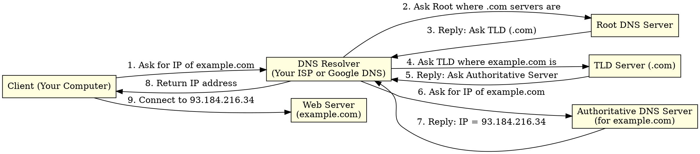

---

####  Step-by-Step: DNS Lookup Process

1. **You type:** `www.example.com` in your browser.
2. **Browser cache check:** Your computer first checks if it already knows the IP address.
3. **Ask the resolver:** If not, it asks a **DNS resolver** (often provided by your ISP).
4. **Root and TLD lookup:** The resolver asks the **root** and **TLD** servers where to find the domain.
5. **Authoritative answer:** The **authoritative server** replies with the actual IP address.
6. **Caching:** The resolver saves the result to speed up future requests.
7. **Connect:** Now your browser connects to the web server using that IP address.

---

#### Diagram: Hierarchy of DNS

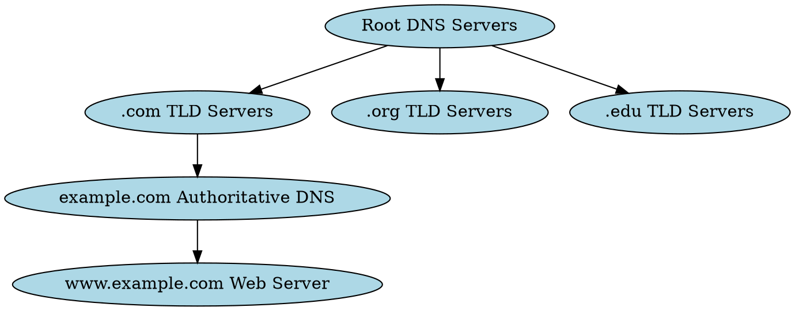

This shows how DNS is organized like a **tree**, starting from the **Root Servers** at the top.

---

####  DNS Caching

DNS lookups take time, so computers use **caching** to remember past results.

* Your browser, computer, and ISP can all **store DNS results** for a short period (like 5 minutes or an hour).
* If you visit the same website again soon, your computer **skips the lookup** and connects faster.

---

#### Fun Fact

There are only **13 main Root Server systems** in the entire world — but each one uses **hundreds of mirrored copies** spread globally for speed and reliability.

---

#### DNS Key Takeaways

DNS is what makes the Internet **easy to use**.
It allows people to use **names** instead of numbers, while computers use **IP addresses** to find each other.

* **DNS = Internet’s phone book.**
* Translates **domain names** → **IP addresses**.
* Involves **clients, resolvers, root, TLD, and authoritative servers**.
* Uses **caching** to speed things up.

---

## Laboratory exercise — send a message with `netcat` (nc)

### Objective 
Use **Computer B** to send the exact text
**Did you get this?**
to **Computer A** using only the command line and `netcat`.

---

### Setup (both computers)

1. Make sure both machines are on the same LAN and can reach each other:

   * On **Linux/macOS**: `ip addr` (look for the IPv4 on the LAN interface, e.g. `192.168.1.12`)
   * On **Windows**: `ipconfig` (look for `IPv4 Address`)

2. Choose a TCP port for the exercise. We'll use **12345** (non-privileged, easy to remember).

---

### For macOS / Ubuntu / most Linux distributions

#### 1. Install `netcat` (if needed)

```bash
sudo apt update
sudo apt install netcat -y
```

*(macOS ships with netcat installed.  Some Linux distributions provide `nc.openbsd` / `netcat-traditional`. The basic `nc` command will work.)*

> Note: different `nc` builds accept slightly different options. If `nc -l 12345` fails, use `nc -l -p 12345`.

#### 2. Start the listener on **Computer A** (receiver)

Open a terminal on Computer A and run **one** of these (try the first; if it errors, try the second):

```bash
# Preferred (works with OpenBSD netcat / modern nc)
nc -l 12345
```

or

```bash
# Alternative syntax used by some netcat builds
nc -l -p 12345
```

Leave that terminal open — it's now listening for a TCP connection on port 12345.

#### 3. Send the message from **Computer B** (sender)

On Computer B open a terminal and run:

```bash
echo "Did you get this?" | nc <IP_of_Computer_A> 12345
```

Replace `<IP_of_Computer_A>` with the receiver's IP (for example `192.168.1.10`).

#### 4. Verify (on Computer A)

Look at the terminal where `nc -l` is running — you should see:

```
Did you get this?
```

That’s it — message delivered!

#### 5. Two-way chat (optional)

If you want a simple interactive chat, do this:

* On **Computer A**: `nc -l 12345`
* On **Computer B**: `nc <IP_of_Computer_A> 12345`

Now both terminals are connected — type on either side and press Enter to send. Close with `Ctrl+C` (or `Ctrl+D` to signal EOF).

---

### For Windows (two easy approaches)

#### Option 1 — Use **Windows Subsystem for Linux (WSL)** (recommended if available)

1. If WSL is installed, open a WSL shell and follow the **Linux** steps above (install `netcat` via `sudo apt install netcat` and use the same commands).
2. WSL uses the same network, so use the host machine’s IP address for the other computer.

#### Option 2 — Use **Ncat** (from Nmap) — native Windows tool

1. Download/install Nmap (includes `ncat`) from the official source or use a package manager (e.g., Chocolatey: `choco install ncat`).
2. Open a **PowerShell** (Run as Administrator on first-run networking changes).

**On Computer A (receiver):**

```powershell
ncat -l 12345
```

**On Computer B (sender):**

```powershell
echo "Did you get this?" | ncat 192.168.1.10 12345
```

*(Replace `192.168.1.10` with Computer A’s IP.)*

#### Windows firewall note

If the connection is blocked, add an inbound firewall rule in PowerShell (run as Administrator):

```powershell
New-NetFirewallRule -DisplayName "AllowNC12345" -Direction Inbound -LocalPort 12345 -Protocol TCP -Action Allow
```

To remove the rule later:

```powershell
Remove-NetFirewallRule -DisplayName "AllowNC12345"
```

---

### Troubleshooting (quick checklist)

* Are the IP addresses correct? (`ip addr` / `ipconfig`)
* Is the listener running on Computer A (terminal still open)?
* Are you using the right port on both sides (12345)?
* Firewall blocking? Temporarily allow the port (Ubuntu: `sudo ufw allow 12345/tcp` or Windows PowerShell rule above).
* If `nc` syntax errors, try the alternate `-l -p` form.

---


