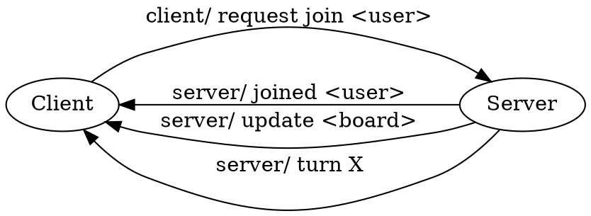
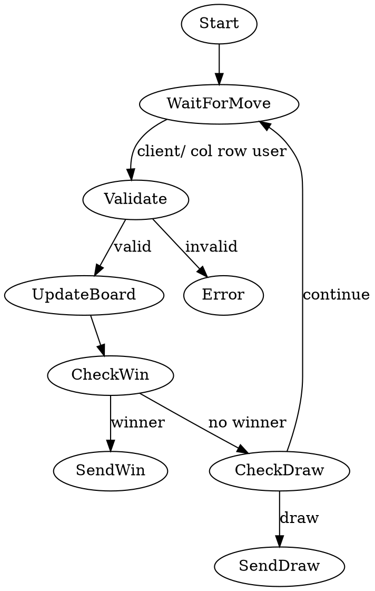
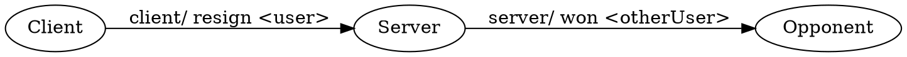

# Token Protocols (Level 2)

**Author** Dr. Jakob W. Kunzler

**Contact** jake.kunzler@gmail.com

**Last Updated** Nov 17 2025

**License** This curriculum is distributed under the creative commons license 4.0.

**Copyright Jakob W. Kunzler 2025**

## Scope

* Students with a basic understanding of the python language
* 15 minutes of reading
* 15 minutes of lab


## Objectives

By the end of this lesson, students will be able to:

1. Explain the purpose of **message protocols** in network communication.
2. Understand how **tokenized commands** help computers interpret and respond to messages.
3. Analyze a real token-based protocol used in a multiplayer tic-tac-toe game.
4. Design and implement their own simple token protocol for communication over ZMQ.
5. Build a small networking program where two threads exchange “phone numbers” using a custom message protocol.

---

## Theory


### What Is a Token Protocol?

A **token protocol** is a structured way to encode information into a message so that both sender and receiver know:

* what the message means
* how to interpret the data inside it
* how to react to it

Computers do not naturally understand messages like humans do.
Humans can parse sentences with ambiguity and missing pieces; computers cannot.

Therefore we use **tokens** — small, simple pieces of text — that a computer can split apart and analyze.

Tokens are typically separated by spaces, slashes `/`, or underscores.

---

### **Why Use Tokens?**

#### Simplicity

Token messages are easy to split:
`"server/ update <board>" → ["server/", "update", "<board>"]`

#### Consistency

Token structure stays the same every time.

#### Predictability

Clients know exactly how to interpret what they receive.

#### Extensibility

New tokens can be added without breaking old messages:

```
server/ leaderboard <json>
server/ ping
server/ restart
```

---

### Common Structure of Token Protocols

A token message usually follows this form:

```
<channel> / <command> <data1> <data2> ...
```

Where:

* **channel** – what category the message belongs to (ex: server or client)
* **command** – the action or event
* **data fields** – details needed for the command

---

### Case Study: Tic Tac Toe Token Protocol

Here is an example of a protocol for implementing a tic tac toe game.

```
Server → Clients ("server/")
---------------------------------
server/ joined <username>
server/ update <ascii-board>
server/ turn <username>
server/ won <username>
server/ draw
server/ error <reason>

Client → Server ("client/")
---------------------------------
client/ request join <username>
client/ <col> <row> <username>
client/ resign <username>
```

This protocol controls the entire flow of the game.

---

### Server Connection & Join Sequence



---

### Server Game Loop (High-Level)



---

### Resignation Flow



### **Conclusion**

This lesson gives students a real-world understanding of how structured token protocols:

* organize communication
* make distributed systems predictable
* allow multiple components to coordinate safely

Using tic tac toe as a running example gives the abstract networking theory something concrete to attach to.


---

## Lab Exercise: Token Protocols With ZMQ

---

### Objective

Students will:

* Implement a custom token protocol.
* Use **ZMQ pub/sub** communication.
* Simulate two friends exchanging contact information.
* Run two threads that pass tokenized messages back and forth.

---

### Lab Scenario: Exchanging Phone Numbers

Two “friends” — Friend A and Friend B — will run in separate Python threads.
Each friend publishes messages and subscribes to the other.

Protocol:

```
friend/ hello <name>
friend/ number <name> <phone>
friend/ thanks <name>
```

---

### Lab Skeleton Code

Students can copy this into a file called:
`token_lab.py`

### **Imports and Setup**

```python
import zmq
import threading
import time
```

---

### **Friend Thread Function**

Each friend sends a greeting, waits, sends their phone number, and then thanks the other.

```python
def friend(name, phone, pub_port, sub_port):
    ctx = zmq.Context()

    # Publisher
    pub = ctx.socket(zmq.PUB)
    pub.bind(f"tcp://*:{pub_port}")

    # Subscriber
    sub = ctx.socket(zmq.SUB)
    sub.connect(f"tcp://localhost:{sub_port}")
    sub.setsockopt_string(zmq.SUBSCRIBE", "friend/")

    time.sleep(1)  # allow connections to form

    # Send greeting
    pub.send_string(f"friend/ hello {name}")
    time.sleep(0.5)

    # Send your phone number
    pub.send_string(f"friend/ number {name} {phone}")

    # Listen for messages
    for _ in range(3):
        msg = sub.recv_string()
        tokens = msg.split()

        print(f"[{name} received]: {msg}")

        if tokens[1] == "hello":
            print(f"[{name}]: Saying hello back!")
        elif tokens[1] == "number":
            sender = tokens[2]
            their_phone = tokens[3]
            print(f"[{name}]: Got {sender}'s number: {their_phone}")
            pub.send_string(f"friend/ thanks {name}")
```

---

## **Main Lab Driver**

Runs two “friends”:

```python
def run_lab():
    print("Starting phone-exchange protocol lab...")

    th1 = threading.Thread(
        target=friend,
        args=("Alice", "555-1234", 5001, 5002)
    )
    th2 = threading.Thread(
        target=friend,
        args=("Bob", "555-9876", 5002, 5001)
    )

    th1.start()
    th2.start()

    th1.join()
    th2.join()

    print("\nLab complete!")
```

---

## **Run the Lab**

```python
if __name__ == "__main__":
    run_lab()
```

---

### **Lab Discussion Questions**

1. Why is it important that both friends use the same token protocol?
2. What would happen if one friend sent `"friiend/helloo"` instead of `"friend/ hello"`?
3. How does splitting a message into tokens make the program easier to test?
4. Compare this lab’s protocol to the tic-tac-toe protocol — what patterns do you notice?

---

